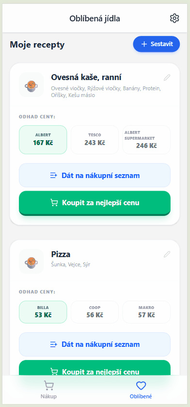

# 🛒 Chytrý Nákup (PWA)

## 📸 Preview
 

Webová aplikace (Progressive Web App), která pomáhá uživatelům optimalizovat nákupní seznam. Porovnává položky v košíku s aktuálními slevami v supermarketech a vypočítá nejvýhodnější kombinaci nákupu.

## 🚀 Aktuální stav projektu (Status Report)

**Fáze:** Funkční MVP (Minimum Viable Product) s hybridním modelem dat.

Aplikace má kompletní UI, fungující nákupní košík s perzistencí dat a napojení na živou databázi slev. Hlavní výzvou je nyní **kvalita a normalizace dat** (jednotky, balení), na které závisí přesnost optimalizátoru.

### 🛠 Technický Stack
* **Frontend:** React 18, TypeScript, Vite
* **Styling:** Tailwind CSS v4 (Mobile First design)
* **Backend / DB:** Supabase (PostgreSQL)
* **State Management:** React Hooks + LocalStorage (bez nutnosti loginu)
* **Logika:** Vlastní skórovací algoritmus pro párování produktů (`ceny.ts`)

---
---

## ✨ Klíčové Funkce

### 1. Chytrý Nákupní Seznam
* **Našeptávač:** Uživatel vybírá produkty z centrální databáze (`global_products` v Supabase).
* **Vlastní položky:** Pokud produkt neexistuje, uživatel ho vytvoří -> systém to zaloguje do `user_suggestions` pro budoucí schválení.
* **Perzistence:** Košík se ukládá do `localStorage`, takže nákup nezmizí ani po zavření prohlížeče.
* **Editace:** Možnost měnit množství, jednotky a přidávat upřesňující štítky (např. "3vrstvý").

### 2. Algoritmus Optimalizace Cen (`ceny.ts`)
Jádro aplikace. Nejde jen o prosté vyhledávání, ale o **Hybridní Cenotvorbu**:

1.  **Hledání slev (Supabase):**
    * Algoritmus stáhne aktuální akční letáky z tabulky `products`.
    * Používá **Scoring System**: Boduje shodu názvu a štítků (např. hledám "Toaletní papír" + štítek "3vrstvý" -> produkt s "3vrstvý" v názvu dostane +100 bodů).
2.  **Fallback (Záchranná síť):**
    * Pokud položka není v akci, algoritmus sáhne do lokálního souboru `bezne_ceny.ts` (statická mapa průměrných tržních cen).
    * *Výsledek:* Uživatel vidí reálný odhad ceny nákupu, ne chybu nebo nulu.

### 3. Výsledky a Žebříček
* Zobrazení **TOP obchodů** seřazených podle celkové ceny nákupu.
* Detekce chybějících položek (penalizace v algoritmu).
* Detailní rozpad nákupu (která položka je v akci a která za běžnou cenu).

---

## ⚠️ Výzvy a Known Issues

Aktuálně největší brzdou je **Kvalita Dat (Data Engineering)**.

* **Jednotky a Balení:** Algoritmus občas selhává v přepočtu kusových položek vs. balení (např. Toaletní papír 8ks vs 1ks).
    * *Příčina:* V databázi často chybí explicitní sloupce `amount` (počet v balení) a `unit`.
    * *Řešení:* Nutnost zlepšit parser dat v Python scraperu nebo ručně dočistit data v Supabase.
* **Fuzzy Matching:** Vyhledávání spoléhá na shodu stringů (s normalizací). Uživatel musí zadat "Rajče", ne "Rajcata" (pokud není v synonymech).

---

## 🔜 Roadmap (Co dál)

2.  **Crowdsourcing:** Umožnit uživatelům nahlásit chybnou cenu přímo v aplikaci.
3.  **UI/UX:** Přidat filtrování obchodů (např. "Chci vidět jen Lidl a Kaufland").
4.  **Backend:** Automatizace stahování letáků do Supabase (cron job).

---

## 📂 Struktura Projektu

* `/src/pages/Nakup` - Logika nákupního seznamu (vstup dat).
* `/src/pages/Optimum` - Výsledky, žebříček obchodů, stahování dat.
* `/src/utils/ceny.ts` - **Mozek aplikace** (výpočetní a párovací logika).
* `/src/data/bezne_ceny.ts` - Fallback ceník pro zboží mimo akci.

---

## 📦 Jak spustit projekt

1.  Nainstalovat závislosti:
    ```bash
    npm install
    ```
2.  Spustit lokální server:
    ```bash
    npm run dev
    ```